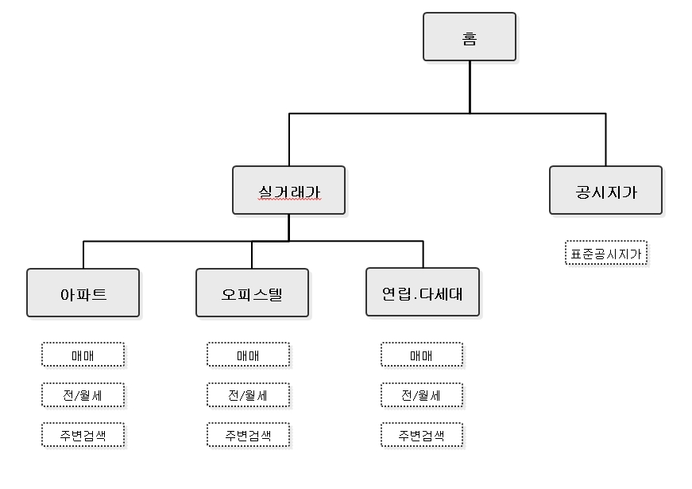
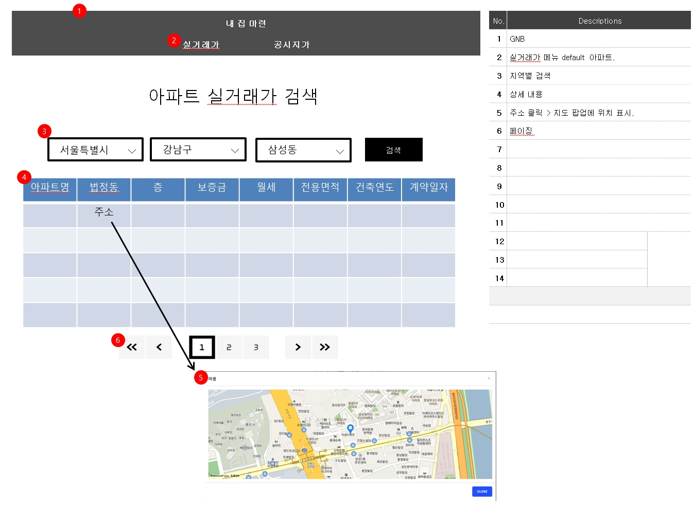
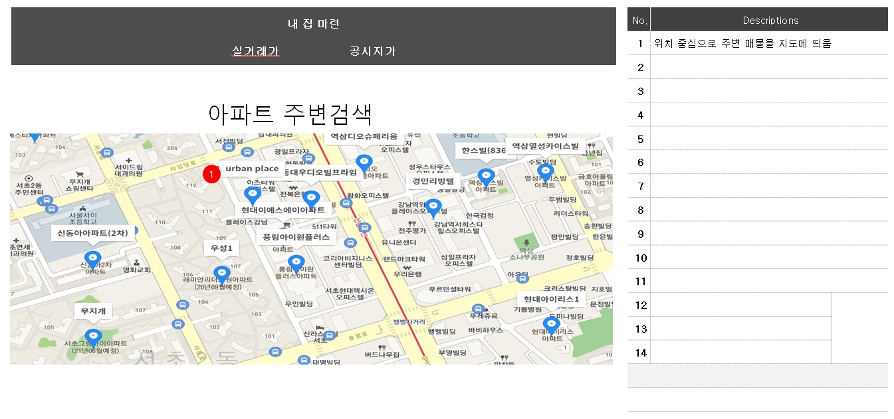

# python과 mongoDB를 이용한 프로젝트

## 프로젝트 이름/설명

이름 : 우리집 사려면..

설명 : 부동산 시세를 알아보기 위해 주변 매물과 아파트, 오피스텔, 빌라등 다양한 종류의 집들의 가격을 찾아보고 실거래가를 알아본다.

## 기획의도

부동산에 대한 관심을 갖고 시세를 알아보며 먼 미래에 내집마련 실현에 도움이 될 만한 정보들을 알아볼 수 있기 위해 기획하게 되었다.

## 개발해야 하는 기능

- 지역별 검색
- 리스트 페이징처리
- 검색 된 건물의 위치 지도에 표시하기
- 지도를 활용하여 실거래가 정보 표시하기

## 스토리보드

메뉴

예시1

예시2

> 개발 시작하기 전..

- python과 mongoDB를 활용하기에 적합한지 모르겠음..
- 아직 api 활용이 가능한지 모르는데 너무 장황한 계획을 한게 아닌가..
